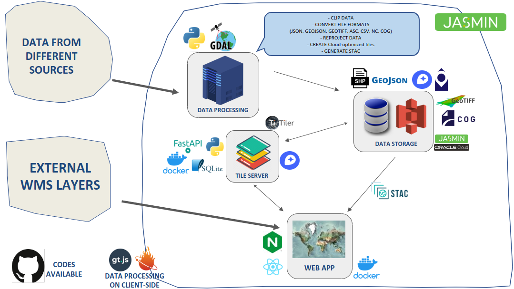

# Coastal Ecosystem Enhancement Decision Support (CEEDS) Tool

The Coastal Ecosystem Enhancement Decision Support (CEEDS) tool is an essential part of the Sustainable Management of Marine Resources (SMMR) funded Restoration of Seagrass for Ocean Wealth (ReSOW) UK project. CEEDS consolidates all data and reports from the project into an accessible, spatially-explorable format that aligns with the community's needs and priorities.

This repository contains the frontend code for the CEEDS tool.

## System Architecture

The CEEDS tool employs an innovative approach to managing extensive geospatial data with a streamlined and scalable system architecture. This approach is built on four key components: cloud-optimized data, object stores, dynamic tile servers, and static web interfaces. We pre-generate results (layers) and store them in cloud-native data formats such as Cloud Optimized GeoTIFF, Zarr, Flatgeobuf, and MBTiles. These formats allow users to access only the necessary portions of data, enabling efficient parallel processing and access without requiring complete downloads.

Data is stored using the JASMIN Object Store, a S3-compatible object storage system from the UK's data analysis facility for environmental science. This storage solution supports the management of large datasets with parallelized file systems capable of multiple concurrent reads and HTTP range requests for partial data fetching. This is crucial for effective integration with cloud-optimized files.

Tiles for the web map application are generated on-the-fly using lightweight tile server applications on serverless architectures, significantly reducing the system's operational footprint.

All data processing is performed client-side, enhancing the website's scalability.

Below is the system architecture diagram:

## Features

The web application offers the following features:
- **Interact with Layers Produced by the ReSOW Project**  
  The ReSOW project has generated the following layers:
  - Habitat Suitability Maps
  - Seagrass extent from satellite data
  - Case study summaries

- **Interact with Layers Produced by Third Parties**  
  Additional map layers include data on:
  - Bathymetry, carbon stocks, marine protected areas, seagrass extent from in-situ surveys, seabed habitats, and administrative areas

- **Download Data from the Map**  
  Users can download data in various formats, either for specific areas or entire layers.

- **Upload Your Own Data**  
  Supported formats for data upload include Shapefile, GeoJSON, GeoTIFF, COG, CSV, KML, and KMZ.

- **Interact with Layers**  
  Some layers (in cloud-optimized data formats) allow user interaction to retrieve values and generate graphs.

- **Generate Screenshots**  
  Users can capture screenshots of the map for use in presentations or reports.

## Data Catalog

All data used in this project is described in a STAC catalog, accessible at: [CEEDS Data Catalog](https://radiantearth.github.io/stac-browser/#/external/ceeds-tool-store-o.s3-ext.jc.rl.ac.uk/ceeds/stac/catalog.json?.language=en)

## 3D Visualization

Data can also be visualized in 3D, powered by Cesium maps. Note that this feature is still under development and may contain bugs.